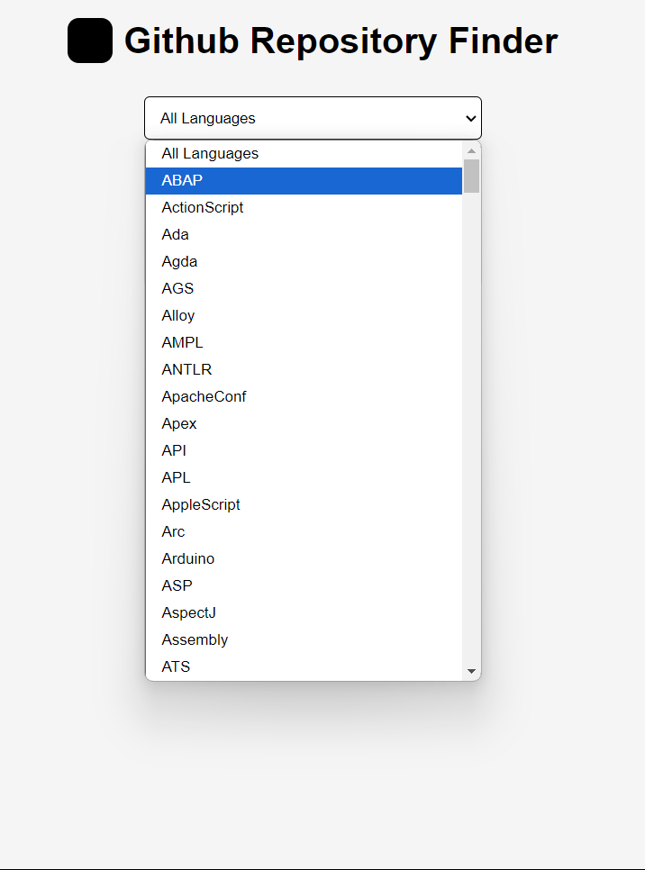

GitHub Random Repository Finder

A web application to find random GitHub repositories based on programming language.

Features

- Search for repositories by programming language
- Displays repository name, description, stars, forks, and open issues
- Fetches a new random repository with a button click

Installation

1. Clone the repository: `git clone (link unavailable)
2. Navigate to the project directory: cd github-random-repo-finder
3. Install dependencies: npm install (or yarn install)
4. Start the application: npm start (or yarn start)

Usage

1. Open the application in your web browser: http://localhost:3000
2. Select a programming language from the dropdown menu
3. Click "Find Repository" to display a random repository

Technologies Used

- Frontend: HTML, CSS, JavaScript
- Backend: Node.js, Express.js
- API: GitHub Repository Search API

Contributing

Contributions are welcome! Please fork the repository, make changes, and submit a pull request.

License

This project is licensed under the MIT License.

Authors

- (link unavailable)

Acknowledgments

- GitHub API documentation

Version History

- v1.0.0 - Initial release

API Documentation

- (link unavailable)

Support

For issues or feature requests, please open an issue on GitHub.

Commit Message Guidelines

- Use present tense (e.g., "Add feature")
- Keep messages concise and descriptive
